# Solução de Captchas

## Introdução

Para abrir as informações sobre os processos no TJRJ é necessário solucionar captchas como mostrado na figura abaixo.

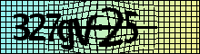

Para solucionar o captcha de forma automática seguiremos os seguintes passos:

1. Indistorcer a imagem;
2. Filtrar os caracteres do ruído;
3. Reconhecer o texto da imagem filtrada.

## Indistorção da imagem

### Caracterização da Distorção

Para gerar a imagem indistorcida, para cada pixel $`(x_u, y_u)`$ da imagem indistorcida determinaremos qual pixel $`(x_d, y_d)`$ da imagem distorcida usar. Em geral o pixel $`(x_d, y_d)`$ não tem coordenadas inteiras, então usaremos interpolação bilinear para determinar seu valor.

A distorção é preponderantemente radial com centro no pixel $`(x_c, y_c) = (110, 30)`$ e está limitada ao círculo de distorção de raio $`r_0 = 63`$, fora desse círculo não há distorção.

Para caracterizar a distorção, usando simetria ao redor dos eixos $`x = x_c`$ e $`y=y_c`$ reconstruímos manualmente a imagem da grade retangular distorcida:

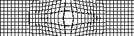 

Construímos a função `find_grid_crossings(image, pattern_size)` que recebe essa imagem e retorna uma tabela com as coordenadas dos $`44 \times 9`$ pontos distorcidos, gravados nos arquivos `xds.csv` e `yds.csv`, para calibração do modelo.

### Modelo Radial

Primeiramente, tentaremos o modelo de distorção puramente radial. 

Dentro do círculo de distorção de raio $`r_0`$, a distorção radial é modelada pela seguinte equação:

$`(x_d - x_u) / (x_u - x_c) = (y_d - y_u) / (y_u - y_c) = f(r^2)`$

onde $`r^2 = (x_d - x_c)^2 + (y_d - y_c)^2`$.

As condições de contorno do modelo são $`f(r_0^2) = 0`$ e $`f'(r_0^2) = 0`$.

O modelo radial assume que a distorção horizontal $`(x_d - x_u) / (x_u - x_c)`$ é igual à distorção vertical $`(y_d - y_u) / (y_u - y_c)`$ em cada ponto e que ela só depende de $`r`$.

Podemos aproximar $`f(r^2)`$ por polinômio com a seguinte forma, que obedece às condições de contorno:

$`f(r^2) = K_1 * (r_0^2 - r^2)^2 + K_2 * (r_0^2 - r^2)^3 + \cdots`$

onde os $`K_n`$ são os parâmetros de calibração do modelo.

Para descobrir em que grau parar, pesquisamos na faixa de 2 a 20, usando leave-one-out cross-validation,  usando a métrica da média de erro quadrático:

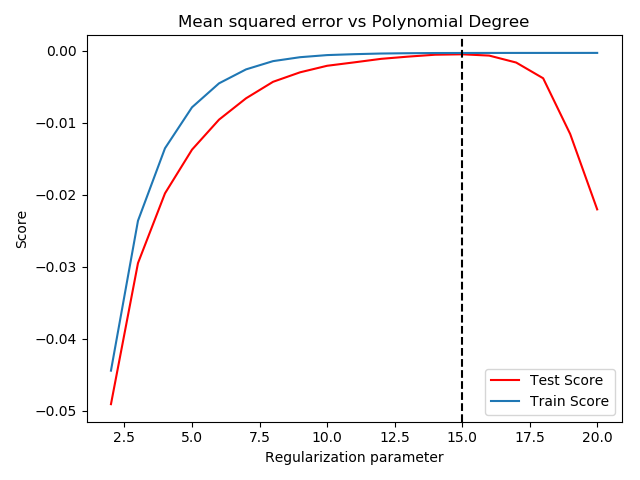

Podemos ver que o melhor grau é 15.

Podemos visualizar a aderência do modelo aos dados por meio do seguinte gráfico.

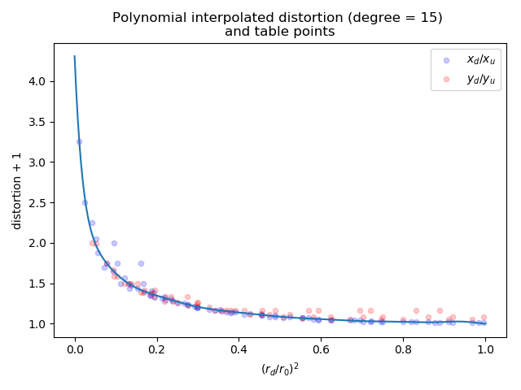 

Observando o gráfico, verificamos que o resultado é insatisfatório, porque as premissas do modelo radial não foram satisfeitas:

- a distorção na horizontal é significativamente diferente da distorção na vertical em muitos pontos;
- a distorção não depende somente de $`r`$.

### Modelo de Spline de Duas Variáveis

O modelo radial é o mais simples, modelado por uma única função que associa o raio, $`r`$, e a distorção, como vimos, não permite uma indistorção satisfatória. Portanto deve ser abandonado em favor de  um modelo bidimensional, que associa cada ponto indistorcido, $`(x_u, y_u)`$, ao ponto distorcido, $`(x_d, y_d)`$.

A base de treinamento do modelo é composta pelos $`44 \times 9`$ pontos distorcidos extraídos da grade retangular padrão. Portanto, temos um problema de interpolação dos pontos desconhecidos fora da grade.

Para evitar o fenômeno de Runge, no qual oscilações ocorrem entre os pontos ao usar polinômios de grau elevado, resolvemos usar interpolação de Spline cúbica, onde o interpolador é um tipo especial de polinômio por partes chamado de Spline .

O modelo de interpolação de Spline foi implementado na função `captcha_distortion.undistort(image)`, que retorna a imagem indistorcida. O modelo possui 2 parâmetros  internos: o raio de distorção, $`r_0`$, e o nível branco, que é o nível acima do qual o pixel é considerado branco para eliminar o gradiente colorido no plano de fundo. Esses parâmetros são diferentes para cada captcha e seu valor é avaliado pela função por meio de análise da `image` dada.

Usando o modelo com interpolação de Spline, obtivemos um modelo satisfatório, gerando as seguintes imagens indistorcidas para 10 captchas de teste:

 ==> 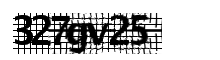 

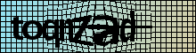 ==> 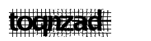 

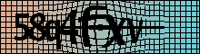 ==> 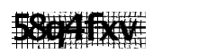 

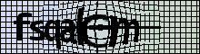 ==> 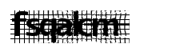

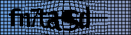 ==> 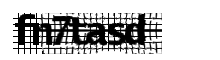

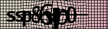 ==> 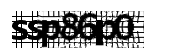 

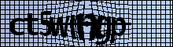 ==> 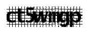

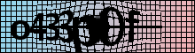 ==> 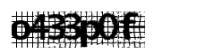

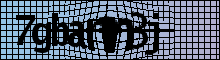 ==> 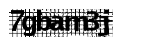

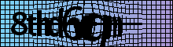 ==> 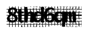 

## Filtragem do Ruído

### Algoritmo Ingênuo

Sem usar técnicas mais sofisticadas, a filtragem do ruído pode ser feita pela aplicação de duas transformações, na seguinte ordem:

* Binarização da imagem;
* Filtragem do ruído propriamente dita.

Implementamos a filtragem na função `noise_filter.clean(image, threshold=139)`, que devolve a imagem filtrada.

O parâmetro `threshold` é utilizado para binarização da imagem, o valor 139 foi escolhido de forma experimental como o melhor limiar para ajustar todos os pixels da imagem para preto ou branco, de modo que Tesseract consiga ler a imagem.

Para fazer a filtragem, usamos uma abordagem ingênua, que elimina qualquer sequência menor do que 3 pixels pretos na horizontal ou vertical, varrendo 2 vezes a imagem inteira.

Passando os 10 captchas de testes por essa filtragem de ruído, obtivemos o seguinte resultado:

 ==> 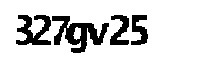 

 ==>  

 ==>  

 ==> 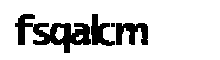

 ==> 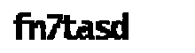

 ==> 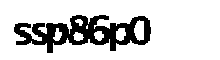 

==> 

 ==> 

 ==> 

 ==> 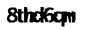 

Tesseract  só acertou a leitura em apenas dois casos: "327gv25" e "toqnzad". 

O algoritmo precisa ser melhorado, notamos que a presença de artefatos como linhas brancas e rebarbas em alguns caracteres.

### Filtragem Usando Técnicas do Domínio das Frequências

#### Filtro Passa-Baixas Usando Convolução Discreta Bidimensional

Analisando a imagem indistorcida, notamos que o ruído é constituído por linhas mais finas, com predominância das frequências mais altas, enquanto os caracteres são constituídos por linhas mais grossas, com predominância de frequências mais baixas, o que nos leva a considerar o uso de um filtro passa-baixas.

A imagem indistorcida possui uma linha horizontal central mais grossa, com conteúdo harmônico em frequência mais baixa, que poderia passar pelo filtro passa-baixas. Mas é fácil fazer uma rotina para eliminar essa linha antes de passar a imagem através do filtro passa-baixas e assim foi feito.

O filtro passa-baixas foi implementado usando [convolução discreta bidimensional](https://en.wikipedia.org/wiki/Multidimensional_discrete_convolution). Num sentido muito geral, convolução é uma operação entre uma imagem, $`I[x, y]`$  e um operador representado por uma kernel, $`K_{i, j}`$, resultando uma imagem, $`H[x, y]`$.

Uma *kernel* , $`K_{i, j}`$ é essencialmente uma matriz $`n \times m`$  junto com um *ponto âncora*, $`[a_x, a_y]`$, nessa matriz, tipicamente localizada no centro.

A convolução é calculada pela seguinte fórmula:

$`H[x, y] = \sum_{i=0}^n \sum_{j=0}^m K_{i, j}I[x + i - a_x, y + j - a_j]`$

Um *kernel quadrado* de tamanho 3 é o suficiente para discriminar os corpos dos caracteres do ruído:

$`K = \frac{1}{3 \cdot 3} \begin{pmatrix} 1 & 1 & 1 \\ 1 & 1 & 1 \\ 1 & 1 & 1 \end{pmatrix}`$

O efeito visual dessa operação é borrar a imagem:

 ==> 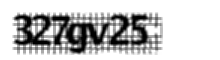

Ao borrar a imagem, diminui o tom do ruído e mantém o tom dos caracteres.

#### Obtenção do Traçado Essencial dos Caracteres

Da imagem filtrada podemos obter o traçado essencial dos caracteres, binarizando a imagem, mantendo somente os pixels que são realmente escuros:

 ==> 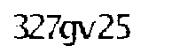

#### Engrossamento do Traçado dos Caracteres

Agora, temos que engrossar o traçado dos caracteres usando um brush do mesmo tamanho, $`3 \times 3`$, do kernel:

 ==>  

#### Resultado

Implementamos os passos acima reescrevendo a função `noise_filter.clean(image, threshold=30)`. Observamos que o valor default do `threshold=` de binarização, obtido manualmente, por experimentação, é bem pequeno, somente para manter os pixels que sejam realmente escuros.

Passando os 10 captchas de teste por essa filtragem de ruído, obtivemos o seguinte resultado:

 ==>  

 ==> 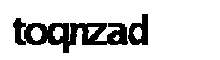 

 ==>  

 ==> 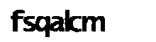

 ==> 

 ==> 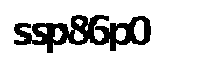 

==> 

 ==> 

 ==> 

 ==> 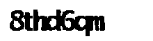 

Fazendo o reconhecimento das imagens filtradas por Tesseract, obtivemos acerto em apenas três deles: "327gv25", "58q4fxv" e "7gbam3j".  No entanto, "toqnzad", que tinha sido reconhecido usando o filtro anterior, não foi reconhecido usando este filtro.

Visualmente, o resultado obtido com este filtro foi superior ao anterior: com menos linhas brancas e rebarba. Verificamos que o resultado ficaria melhor ainda mudando o valor do `threshold` de binarização para cada instância de captcha, ao invés de usar o valor fixo 30 para todos.

## Reconhecimento de Caracteres Usando Tesseract

Para o reconhecimento de caracteres usaremos o Tesseract, uma biblioteca de OCR patrocinada por Google, considerado por muitos o melhor e mais preciso sistema de OCR de código aberto à disposição.

Além de ser preciso, o Tesseract é extremamente flexível. Pode ser treinado para reconhecer qualquer quantidade de fontes.

#### Configuração Default

Construímos a função `ocr.read(image)`, que retorna uma string com o texto reconhecido e um número entre 0 e 100, que mede a confiabilidade do reconhecimento.

Passando o produto da última versão de filtragem de ruído dos 10 captchas de teste pelo reconhecedor obtivemos o seguinte resultado (erros **grifados**):

 ==> 327gv25, 35

 ==> **?**, 0

 ==> 58q4fxv, 86

 ==> fsqa**k**m, 95

 ==> **?**, 0

 ==> **?**, 0

==> ct**S**w**in**gp, 39 

 ==> **0**433p0f, 81

 ==> 7gbam3j, 30

 ==> **?**, 0

Verificamos que há dois tipos de resultado: quando Tesseract falha totalmente e não retorna nada (marcado com "**?**") e quando retorna algum resultado. O primeiro caso ocorre em 40% da amostra. No segundo caso, tivemos cerca de 86% de acurácia para cada caractere. 

#### Ajuste da Configuração

Por default Tesseract é otimizado para reconhecer sentenças em um idioma. No nosso caso, estamos querendo reconhecer um código de 7 caracteres com letras minúsculas e números, então podemos ajustar a configuração para aprimorar a acurácia dos resultados:

* Selecionar o método de segmentação para tratar a imagem como uma única palavra;
* Desabilitar os dicionários que Tesseract usa;
* Adicionar o padrão de 7 caracteres;
* Usar a lista branca de caracteres com letras minúsculas e números.

A configuração é feita de forma bastante simples por meio de arquivos que colocamos na pasta `./tessdata/`. É importante colocar essa pasta no diretório do projeto para facilitar o deployment do projeto.

Tesseract também permite customização por meio de treinamento. Mas observamos que os erros de reconhecimento não estão ocorrendo devido ao uso de uma fonte incomum, o problema é do espaçamento entre os caracteres: eles estão muito juntos e encostam com o vizinho, atrapalhando o reconhecimento. Assim o treinamento não seria muito eficaz neste caso.

Após o ajuste na configuração, repetimos o teste de reconhecimento, obtendo os resultados a seguir (erros **grifados**):

 ==> 327gv25, 41

 ==> toqn**m**zad, 0

 ==> 58q4fx**y**, 0

 ==> fsqa**k**cm, 48

 ==> fn7tasd, 58

 ==> ssp86p0, 66

==> ct5wmgp, 11 

 ==> **0**433p0f, 1

 ==> 7gba**rd**j, 32

 ==> 8thd6q**n**, 12

Verificamos que houve melhora significativa do reconhecimento, com um simples ajuste na configuração:  agora Tesseract sempre retorna resultado e a acurácia melhorou para 90% por caractere.

## Ajuste Automático da Filtragem de Ruído

Verificamos que o resultado da filtragem de ruído melhoraria mudando o valor do `threshold` de binarização para cada instância de captcha, ao invés de usar o valor fixo 29 para todos.

Por outro lado, para cada reconhecimento, Tesseract nos fornece uma medida da confiabilidade do reconhecimento.

Surge então a ideia de ajustar automaticamente o valor do `threshold` de forma a maximizar a confiabilidade.

Implementamos essa ideia na função `search_ocr(image)`, que recebe a imagem com ruído, `image`, e retorna o texto reconhecido, a imagem limpa, a confiabilidade e o valor de `threshold` do reconhecimento de maior confiabilidade, de acordo com Tesseract.

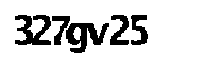 ==> 327gv25, 41

 ==> toq**m**zad, 50

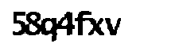 ==> 58q4fxv, 11

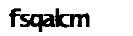 ==> fsqa**k**cm, 62

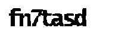 ==> fn7tasd, 64

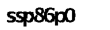 ==> ssp86p0, 68

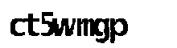==> ct**o**wmgp, 44 

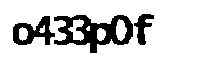 ==> **0**433p0f, 22

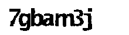 ==> 7gbam3j, 52

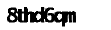 ==> 8thd6q**n**, 33

Visualmente, o resultado da filtragem de ruídos foi marginalmente melhor.

Tivemos também uma pequena melhora na acurácia para 92.5% por caractere. Isso significa que a acurácia  por captcha de 7 caracteres será de 58%. 

## Discussão

Na seção anterior, tivemos uma pequena melhora na acurácia, mas essa melhora foi a custa do aumento de 13 vezes no tempo de leitura de 0.93 segundo para 13 segundos. 

Levando em conta que sempre é possível tentar outro captcha em caso de erro e, em geral, nenhum limite é estabelecido para o número de vezes que os usuários podem fazer tentativas de resolver o captcha, será mais eficiente usar o algoritmo anterior, porque a versão anterior pode fazer 14 tentativas no mesmo tempo que a última versão tenta ler um único captcha.

Além disso, durante todo os 13 segundos de processamento a thread ficaria ocupada. Com o algoritmo da seção anterior, a thread é liberada em menos de 1 segundo.

Portanto, optamos por descartar o último algoritmo e ficar com o algoritmo anterior, que, embora seja menos acurado, é mais eficiente. 

## Testes de Unidade Automáticos com Pytest

Fixado o algoritmo, vamos implementar, usando a biblioteca Pytest, um conjunto de testes automáticos para a leitura de captcha. Cada teste simplesmente submete imagens de captcha previamente armazenados em arquivos e asserta que a resposta dada pelo algoritmo está correta.

```python
# test_captcha_reading.py
import cv2

import noise_filter
import ocr
from captcha_distortion import undistort


def test_327gv25():
    image = cv2.imread("./data/captcha_327gv25.png", cv2.IMREAD_GRAYSCALE)
    captcha, _ = ocr.read(noise_filter.clean(undistort(image)))
    assert captcha == "327gv25"


def test_fn7tasd():
    image = cv2.imread("./data/captcha_fn7tasd.png", cv2.IMREAD_GRAYSCALE)
    captcha, _ = ocr.read(noise_filter.clean(undistort(image)))
    assert captcha == "fn7tasd"


def test_ssp86p0():
    image = cv2.imread("./data/captcha_ssp86p0.png", cv2.IMREAD_GRAYSCALE)
    captcha, _ = ocr.read(noise_filter.clean(undistort(image)))
    assert captcha == "ssp86p0"

```

