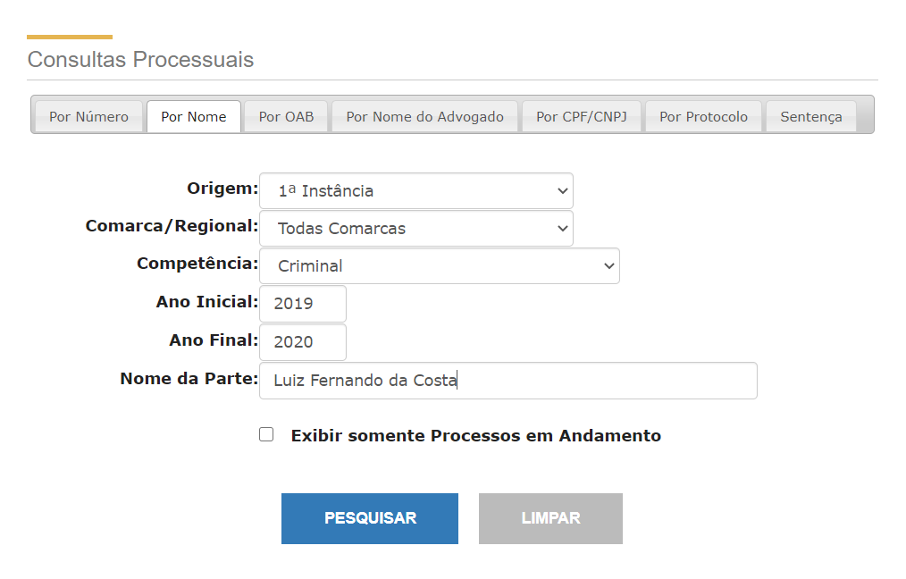
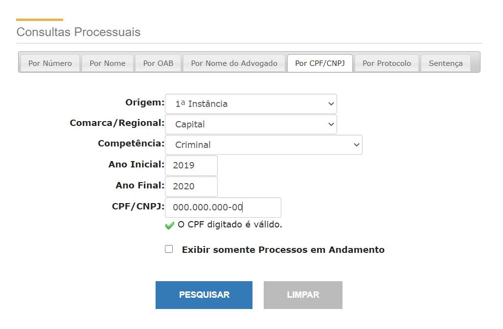
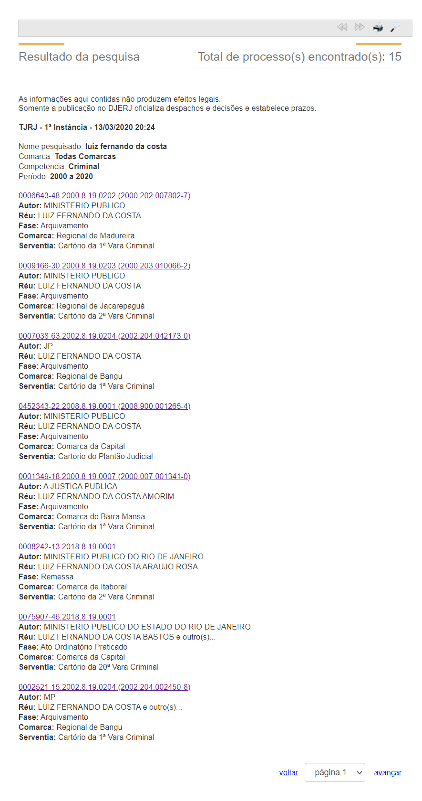

# Scraping de Processos por Nome ou CPF/CNPJ

## Consulta por Nome ou CPF/CNPJ

A consulta por nome é feita pelo formulário mostrado abaixo:



A consulta por CPF/CNPJ é feita pelo formulário mostrado abaixo:



O scraping da página de consulta será implementada pela corrotina `consulta_parte.parse(nome_ou_cpf: str, session: aiohttp.ClientSession, **data)   -> List[Processo]`. 

Por se tratar de corrotina, `consulta_processo.parse` só pode ser chamada por outra corrotina com `await`.

Como nome e CPF seguem padrões diferentes, a mesma corrotina serve para os dois tipos de consulta, usando o mesmo argumento `nome_ou_cpf` para o nome ou CPF/CNPJ da parte. O CPF/CNPJ deve conter pontos, barras e traços.

O argumento `session` é a `ClientSession` onde serão feitas as requisições, de acordo com o padrão de injeção de dependência.

O argumento `data` são argumentos keyword opcionais, presentes nos formulários:

* `comarca` Comarca/Regional no formulário, é uma `Enum` do tipo `Comarca`. Para as consultas por nome o valor default é `Comarca.TODAS_COMARCAS`. Para as consultas por CPF/CNPJ o valor default é `Comarca.CAPITAL`, porque o servidor não aceita consultas por CPF/CNPJ quando a `comarca` é `Comarca.TODAS_COMARCAS`;
* `anoInicio` O valor default é o ano atual menos 20;
* `anoFinal` O valor default é o ano atual;
* `pativos`  `False` se a consulta deve retornar todos os processos ou `True` se a consulta deve retornar só os processos em andamento. O valor default é `False`.
* Na implementação atual, a `origem` sempre será "1ª Instância" e a `competência` sempre será "Criminal". Qualquer valor fornecido para esses argumentos será ignorado.
* Existe também um campo de formulário oculto `acao`, que deve ser igual a "consulta" .

A corrotina retorna uma lista de `Processo`s.

A URL base das consultas é "http://www4.tjrj.jus.br/consultaProcessoNome/".

O formulário de consulta por nome deve ser submetido, usando método POST, para a URL "./ConsultaNome.do".

O formulário de consulta por CPF/CNPJ deve ser submetido, usando método POST, para a URL "./consultaCPF.do".

## Lista de Processos

O servidor envia uma resposta com a lista de processos paginada, com 8 processos por página:



### Paginação

A mudança de página é feita submetendo o formulário, usando método POST, para o a URL "./ConsultaNome.do". Observamos que o URL de navegação é o mesmo, independentemente se a consulta foi feito por nome ou CPF/CNPJ.

Os campos do formulário são os seguintes:

* `acao` deve ser igual a "navegacao";
* `pagina` a pagina para a qual o cliente quer ir;
* `paginaAtual` igual à `pagina`.
* `totPagina` o número total de páginas da consulta.
* `privada` deve ser 0.

## Scraping da Lista de Processos

Ao clicar nos links, abre-se a página com os detalhes do processo e suas últimas movimentações. Porém, ao fazer isso, a paginação deixa de funcionar. Então para fazer o scraping de todos os processos é necessário percorrer todas as páginas e capturar a lista de números de todos os processos, antes de capturar os detalhes de cada processo.

O primeiro loop percorre, página a página, todas as páginas da consulta, guardando os números dos processos na lista `nums_processos`.

Depois nas 6 últimas linhas do código, a lista `num_processos` é iterada para obter os detalhes de cada `Processo`.

```python
# consulta_parte.py
import re
from datetime import date
from typing import List
from urllib.parse import parse_qs, urlparse

import aiohttp
from bs4 import BeautifulSoup, Tag

import consulta_processo
from Comarca import Comarca
from Processo import Processo

URL_BASE = "http://www4.tjrj.jus.br/consultaProcessoNome/"
URL_NOME = URL_BASE + "ConsultaNome.do"
URL_CPF = URL_BASE + "consultaCPF.do"
URL_NAVEGACAO = URL_BASE + "ConsultaNome.do"


async def parse(
        nome_ou_cpf: str,
        session: aiohttp.ClientSession,
        **data,
) -> List[Processo]:
    data["acao"] = "consulta"
    data["descOrigem"] = "1ª Instância"
    data["origem"] = "1"
    data["descCompetencia"] = "Criminal"
    data["competencia"] = "04"
    if "pativos" in data:
        data["pativos"] = str(data["pativos"]).lower()
    today = date.today()
    if "anoInicio" not in data:
        data["anoInicio"] = today.year - 20
    if "anoFinal" not in data:
        data["anoFinal"] = today.year
    if re.match(
            r"((\d{3}\.){2}\d{3}|\d{2}\.\d{3}\.\d{3}/\d{4})-\d{2}",
            nome_ou_cpf
    ):
        data["numeroCpfCnpj"] = nome_ou_cpf
        if "comarca" not in data:
            data["comarca"] = Comarca.CAPITAL
        url = URL_CPF
    else:
        data["nomeParte"] = nome_ou_cpf
        if "comarca" not in data:
            data["comarca"] = Comarca.TODAS_COMARCAS
        url = URL_NOME
    data["descComarca"] = data["comarca"].name

    nums_processos: List[str] = []
    pagina = 1
    print("pagina =", pagina)
    resp: aiohttp.ClientResponse = await session.post(url, data=data)
    markup: bytes = await resp.read()
    content: Tag = BeautifulSoup(
        markup.decode("utf8", "mixed"), "lxml"
    ).find("div", id="content")
    tag: Tag = content.find("input", {"name": "totPagina"})
    tot_pagina = float(tag["value"])
    while True:
        tags: List[Tag] = content.find_all(
            "a", 
            string=re.compile(r"\d{1,7}-\d{2}\.\d{4}\.\d\.?\d\d(\.\d{4})?"),
        )
        for tag in tags:
            nums_processos.append(
                parse_qs(urlparse(tag["href"]).query)["numProcesso"][0]
            )

        if pagina >= tot_pagina:
            break
        pagina += 1

        print("pagina =", pagina)
        resp = await session.post(
            URL_NAVEGACAO,
            data=dict(
                acao="navegacao",
                paginaAtual=pagina,
                totPagina=tot_pagina,
                privada=0,
                pagina=pagina,
            ),
        )
        markup = await resp.read()
        content: Tag = BeautifulSoup(
            markup.decode("utf8", "mixed"), "lxml"
        ).find("div", id="content")

    processos: List[Processo] = []
    for num_processo in nums_processos:
        processo = await consulta_processo.parse(num_processo, session)
        if processo is not None:
            processos.append(processo)
    return processos

```

## Testes com Injeção de Dependência e Mocking

O objetivo é fazer o teste de unidade, ou seja, testar completamente e exclusivamente a corrotina, sem depender de acesso com a Internet nem do scraping de `Processo`. Para isso usaremos técnicas de mocking e injeção de dependência.

### Injeção de `FakeSession`

A corrotina foi desenhada usando o padrão de injeção de dependência por meio do argumento `session`.  Esse objeto controla o acesso ao servidor e para os testes substituímos por uma `FakeSession` que simula o servidor real.

No código abaixo mostramos a codificação de `FakeSession` para simular o servidor somente na consulta de parte por nome ou CPF/CNPJ. O `FakeSession` atual também inclui a simulação de consulta às movimentações de processo, que já foi mostrado em outro capítulo.

```python
import re
from typing import Mapping

import aiofiles

import consulta_parte
import consulta_processo


class FakeClientResponse:
    def __init__(self, filename: str) -> None:
        self.filename = filename

    async def read(self):
        async with aiofiles.open(self.filename, "rb") as file:
            return await file.read()


class FakeSession:
    def __init__(self):
        self.nome_ou_cpf: str = None        
    
    async def post(
            self, url: str, *, data: Mapping = None
    ):
        if data["acao"] == "consulta":
            if url == consulta_parte.URL_NOME:
                self.nome_ou_cpf = data["nomeParte"]
            else:
                # url = consulta_parte.URL_CPF
                self.nome_ou_cpf = re.sub(
                    r"/\d{4}", "", data["numeroCpfCnpj"]
                )
            pagina = 1
        else:
            # data["acao"] = "navegacao"
            pagina = data["paginaAtual"]
        resp = FakeClientResponse(
            f"processos-{self.nome_ou_cpf}-{pagina}.html"
        )

```

A classe `FakeResponse` simula a resposta a uma requisição, enviando como resposta o conteúdo do arquivo `self.filename` fornecido no seu construtor.

A  classe `FakeSession` simula uma sessão HTTP, aceita requisições POST do cliente e envia como resposta arquivos que foram baixados diretamente de respostas reais do site. Os nomes dos arquivos seguem o seguinte padrão "processos-{nome_ou_cpf}-{pagina}.html".  No caso de um CNPJ, foi eliminada a parte do CNPJ relativa á matriz da PJ, que quase sempre é "/0001".

Se o campo `acao` for "consulta" envia como resposta o arquivo baixado correspondente à primeira página da consulta, conforme os campos `nomeParte` ou `numeroCpfCnpj`. A `FakeSession` também guarda o nome ou CPF/CNPJ em `self.nome_ou_cpf`.

Se o campo `acao` for "navegacao" envia como resposta o arquivo baixado correspondente à pagina fornecida no campo `paginaAtual` do formulário e nome ou CPF/CNPJ em `self.nome_ou_cpf`. 

### Mocking do Módulo `consulta_processo`

Queremos testar exclusivamente a corrotina de scraping sem testar novamente o módulo `consulta_processo`. O seguinte trecho de código cria um mock que somente varia o número do processo e mantém o restante dos detalhes fixos. Foi introduzida uma pequena interrupção `await asyncio.sleep(0)` antes do retorno, para simular uma operação de async IO.

```python
import asyncio
from datetime import date
import pytest

from Processo import (
    Processo, Advogado, Movimentacao, MovimentacaoTipo, Pessoa
)


@pytest.fixture()
def mock_processo(monkeypatch):
    async def fake_processo_parse(num_processo: str, session) -> Processo:
        await asyncio.sleep(0)
        return Processo(
            numero=num_processo,
            comarca="Comarca da Capital",
            vara="1ª Vara Criminal",
            classe="Ação Penal - Procedimento Ordinário",
            assunto="Estelionato (Art. 171 - CP)",
            autor="MINISTÉRIO PÚBLICO DO ESTADO DO RIO DE JANEIRO",
            reus=[Pessoa(nome="Luiz Fernando da Costa")],
            advogados=[Advogado(oab="RJ696969", nome="Beltrano da Silva")],
            movimentacoes=[
                Movimentacao(
                    tipo=MovimentacaoTipo.DECISAO,
                    data=date(2020, 2, 24),
                    titulo="Decisão - Recebimento de Denúncia",
                    resumo="Lorem ipsum dolor sit amet",
                    integra=(
                        "Lorem ipsum dolor sit amet, "
                        "consectetur adipiscing elit, "
                        "sed do eiusmod tempor incididunt ut labore "
                        "et dolore magna aliqua."
                    ),
                ),
            ],
        )

    monkeypatch.setattr(consulta_processo, "parse", fake_processo_parse)

```

###  Módulo de Teste

Testamos 3 casos de testes:

* `test_consulta_ficha_limpa`: consulta por nome sem processos criminais;
* `test_consulta_nome`: consulta pelo nome "Luiz Fernando da Costa", vulgo "Fernandinho Beira-Mar";
* `test_consulta_cpf`:  consulta de processos, da parte com CNPJ "28.305.936/0001-40"(Ministério Público do Rio de Janeiro) , da Comarca de Queimados, de 2010 e que ainda estão em andamento.

```python
import asyncio
from datetime import date
from snapshottest.module import SnapshotTest
import pytest

import consulta_parte
import consulta_processo
from Comarca import Comarca
from FakeSession import FakeSession
from Processo import Processo, Advogado, Movimentacao, MovimentacaoTipo, Pessoa
from mixed_decoder import mixed_decoder
import codecs

pytestmark = pytest.mark.asyncio
codecs.register_error("mixed", mixed_decoder)
session = FakeSession()


@pytest.fixture()
def mock_processo(monkeypatch):
    async def fake_processo_parse(num_processo: str, session) -> Processo:
        await asyncio.sleep(0)
        return Processo(
            numero=num_processo,
            comarca="Comarca da Capital",
            vara="1ª Vara Criminal",
            classe="Ação Penal - Procedimento Ordinário",
            assunto="Estelionato (Art. 171 - CP)",
            autor="MINISTÉRIO PÚBLICO DO ESTADO DO RIO DE JANEIRO",
            reus=[Pessoa(nome="Luiz Fernando da Costa")],
            advogados=[Advogado(oab="RJ696969", nome="Beltrano da Silva")],
            movimentacoes=[
                Movimentacao(
                    tipo=MovimentacaoTipo.DECISAO,
                    data=date(2020, 2, 24),
                    titulo="Decisão - Recebimento de Denúncia",
                    resumo="Lorem ipsum dolor sit amet",
                    integra=(
                        "Lorem ipsum dolor sit amet, "
                        "consectetur adipiscing elit, "
                        "sed do eiusmod tempor incididunt ut labore "
                        "et dolore magna aliqua."
                    ),
                ),
            ],
        )

    monkeypatch.setattr(consulta_processo, "parse", fake_processo_parse)


async def test_consulta_ficha_limpa(snapshot: SnapshotTest, mock_processo):
    assert len(await consulta_parte.parse("Fulano da Silva", session)) == 0


async def test_consulta_nome(snapshot: SnapshotTest, mock_processo):
    snapshot.assert_match(
        [
            processo.dict()
            for processo in await consulta_parte.parse(
                "Luiz Fernando da Costa", session
            )
        ]
    )


async def test_consulta_cpf(snapshot: SnapshotTest, mock_processo):
    snapshot.assert_match(
        [
            processo.dict()
            for processo in await consulta_parte.parse(
                "28.305.936/0001-40",
                session,
                comarca=Comarca.QUEIMADOS,
                anoInicio=2010,
                anoFinal=2010,
                pativos=True,
            )
        ]
    )

```

