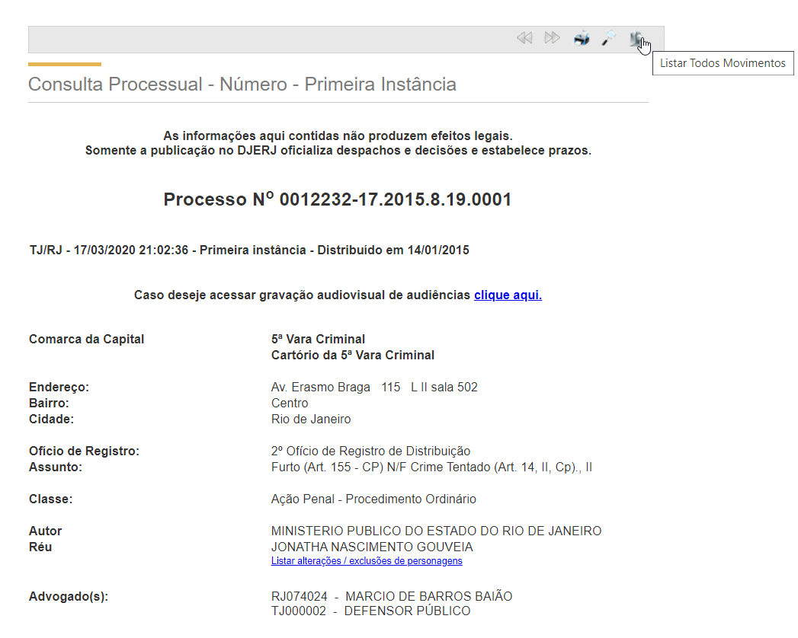
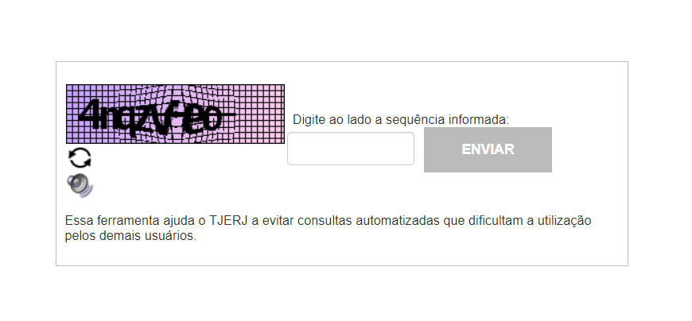
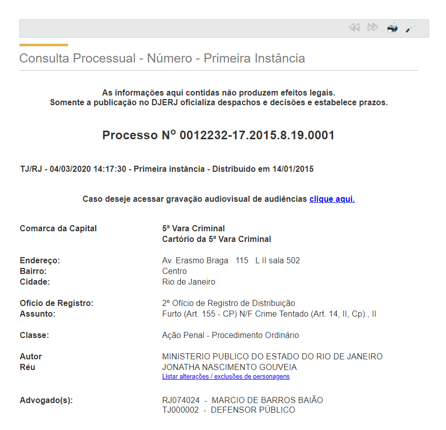
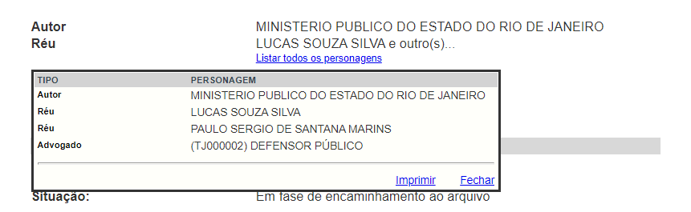

# Scraping de Processo com Async IO

## Modelo Pydantic

Python 3.6 introduziu uma sintaxe para anotação de tipos das variáveis, isso facilitou bastante o desenvolvimento de programas grandes. Com a tipagem das variáveis, muitos bugs podem ser descobertos durante a codificação no IDE, diretamente no local de sua ocorrência, que, sem o uso de tipagem, só seriam descobertos no teste do programa, quando é mais difícil determinar a origem do bug. Além disso, a tipagem facilita o recurso intellisense, que é um termo geral para uma variedade de recursos de edição de código incluindo: completação de código, informação de parâmetros e listas de membros. 

Com a introdução da tipagem, novas bibliotecas aproveitaram o recurso para validação de dados. Uma dessas bibliotecas, que usaremos nesse projeto, é a Pydantic.

O código abaixo define um modelo Pydantic para o scraping dos processos. O código é autoexplicativo.

```python
# Processo.py
from datetime import date
from typing import List

from pydantic import BaseModel

from StrEnum import StrEnum


class MovimentacaoTipo(str, StrEnum):
    DESPACHO = "despacho"
    DECISAO = "decisão"
    SENTENCA = "sentença"


class Movimentacao(BaseModel):
    tipo: MovimentacaoTipo
    titulo: str
    data: date
    resumo: str
    integra: str = None


class Pessoa(BaseModel):
    nome: str
    cpf: str = None


class Advogado(BaseModel):
    oab: str
    nome: str


class Processo(BaseModel):
    numero: str
    comarca: str
    vara: str
    assunto: str
    classe: str
    autor: str
    reus: List[Pessoa] = []
    advogados: List[Advogado] = []
    movimentacoes: List[Movimentacao] = []

```

## Lidando com Sessões e Cookies

O HTTP é um protocolo stateless no qual nenhuma informação de sessão é retida no servidor. Dados relevantes da sessão são enviados ao servidor pelo cliente em toda requisição de tal forma que toda requisição possa ser entendida isoladamente, sem informação de contexto das requisições anteriores na sessão.

Os servidores Web modernos usam cookies para controlar as sessões. Ao abrir a sessão, o servidor envia um cookie de resposta com a identificação da sessão, esse cookie é armazenado no cliente que o envia de volta para o servidor em cada requisição.

Na biblioteca `requests`, o objeto`session` (obtido por meio da chamada `requests.Session()`) mantém o controle das informações da sessão, por exemplo, cookies e headers.

Por exemplo, uma operação de login seria codificada da seguinte forma usando `requests`:

```python
import requests

with requests.Session() as session:
    session.post(
        "http://pythonscraping.com/pages/cookies/welcome.php", 
        data=dict(username="username", password="password")
    )
    print("Cookies:")
    print(session.cookies.get_dict())
    print("Going to profile page...")
    resp = session.get("http://pythonscraping.com/pages/cookies/profile.php")
    markup = resp.text

```

O comando `with` garante que a sessão será fechada depois do uso.

A biblioteca `requests` é uma biblioteca de IO síncrona. As operações de IO síncronas bloqueiam a thread de execução que tem ficar esperando a resposta. Para atingir concorrência é necessário criar várias threads, que, se não forem totalmente independentes, exigem o uso de dispositivos de sincronização, como semáforos ou transações, para evitar condições de corrida.

No exemplo dado, a thread fica bloqueada durante o `session.post` e `session.get` até a resposta do servidor chegar. Se nenhum timeout for especificado explicitamente e o servidor não responder, a thread ficará bloqueada indefinidamente.

## Async IO

Async IO é um modelo de programação concorrente que tem recebido apoio dedicado em Python, evoluindo rapidamente desde Python 3.4 até 3.7 e provavelmente no futuro.

Benchmarks  indicam que programas intensivos em IO, como aplicações Web, [são uma ordem de grandeza mais rápidos](https://www.techempower.com/benchmarks/#section=data-r18&hw=ph&test=query) quando usam async IO. Isso explica porque os aplicativos desenvolvidos em Node.js ou .Net são muito mais rápidos do que seus equivalentes em Python e foi o motivo que levou à introdução de async IO em Python.

Com async IO, uma única thread que executa várias tarefas em loop de eventos, uma operação de IO não bloqueia a thread que pode executar outra tarefa que esteja pronta para execução e, a atomicidade é preservada, dispensando o uso de dispositivos de sincronização.

Para programação de async IO, usaremos as bibliotecas `aiohttp` e `aiofiles`. A biblioteca `aiohttp` tem uma interface muito semelhante à biblioteca  `requests`. 

A mesma operação de login seria codificada da seguinte forma usando `aiohttp`:

``` python
import aiohttp

async with aiohttp.ClientSession() as session:
    await session.post(
    	"http://pythonscraping.com/pages/cookies/welcome.php", 
    	data=dict(username="username", password="password")
	)
    print("Cookies:")
    for cookie in session.cookie_jar
    	print(cookie.key, "=", cookie.value)
    print("Going to profile page...")
    resp = await session.get(
        "http://pythonscraping.com/pages/cookies/profile.php"
    )
    markup = await resp.text()

```

A diferença é abertura da `session` com `async with` e o uso de `await` antes das operações de IO. Nesses pontos, a thread é liberada para executar outra tarefa pronta para execução.

As funções que são chamadas com `await` são denominadas **corrotinas** e são definidas com a seguinte sintaxe:  `async def f():`

Async IO não é boa quando quando temos muitas rotinas intensivas em processamento, que segura a thread por muito tempo. Um exemplo disso é o processamento de leitura de captcha. Daí a importância de usarmos o algoritmo mais rápido de forma a segurar o menos possível a thread em processamento.

## Paginas de Codificação Mista

A resposta do site do TJRJ vem com codificação mista: o texto da página está codificado no padrão antigo Windows-1252, mas o texto das movimentações estão codificados no padrão moderno utf-8. Se tentarmos ler como utf-8, ocorrerá o levantamento de um erro. Se tentarmos ler como Windows-1252, não serão levantados erros, mas aparecerão caracteres estranhos no texto das movimentações.

Temos então que primeiro fazer uma leitura da resposta bruta em bytes binários, depois tentar fazer a decodificação mista dessa resposta. A ideia é tentar primeiramente decodificar usando utf-8 e quando isso não for possível tentar usar Windows-1252.

Podemos codificar a decodificação Windows-1252 em um handler de erro:

```python
# mixed_decoder.py

def mixed_decoder(error: UnicodeError) -> (str, int):
    bs: bytes = error.object[error.start: error.end]
    return bs.decode("cp1252"), error.start + 1

```

Depois registrar o handler nos codecs:

```python
import codecs

codecs.register_error("mixed", mixed_decoder)

```

## Consulta às Movimentações

Ao iniciar a consulta processual o site, mostra uma página inicial como abaixo.



A primeira vista, essa página tem tudo que precisamos saber do processo, mas, analisando mais detidamente, notamos que essa página só lista os últimos movimentos do processo. 

Como estamos interessados todos os movimentos, **não devemos usar essa página** e, sim, temos que **acessar a lista de todos os movimentos** clicando o **botão mais à direita** na barra de navegação.

O scraping da página do processo será implementada pela corrotina `consulta_processo.parse(num_processo: str, session: aiohttp.ClientSession) -> Processo`. 

Por se tratar de corrotina, `consulta_processo.parse` só pode ser chamada por outra corrotina com `await`.

O argumento `num_processo` deve ser a da  numeração antiga.

O parâmetro `session` é a `ClientSession` onde serão feitas as requisições, de acordo com o padrão de injeção de dependência.

A corrotina retorna o `Processo` requerido e todas as `movimentacoes` relevantes.

A consulta à lista de todos os movimentos do processo é feita por meio uma requisição GET na URL `"http://www4.tjrj.jus.br/consultaProcessoWebV2/consultaMov.do"`, passando os parâmetros da consulta: `num_processo`, `v=2`, `acessoIP="internet"`.

Assim já podemos começar a codificar a corrotina `consulta_processo.parse`:

```python
# consulta_processo.py
import aiohttp
from bs4 import BeautifulSoup

URL = "http://www4.tjrj.jus.br/consultaProcessoWebV2/consultaMov.do"


async def parse(num_processo: str, session: aiohttp.ClientSession) -> Processo:
    print("num_processo =", num_processo)
    params = dict(
        v=2,
        numProcesso=num_processo,
        acessoIP="internet",
    )
    resp: aiohttp.ClientResponse = await session.get(URL, params=params)
    markup: bytes = await resp.read()
    soup = BeautifulSoup(markup.decode("utf-8", "mixed"), "lxml")

```
Observe que fizemos a leitura bruta binária da página para depois a decodificar usando código misto.

## Loop de Captcha

Quando o cliente faz uma requisição de consulta às movimentações pode receber um Captcha como resposta:



O cliente deve submeter o formulário, usando o método POST, para o mesmo URL, com os parâmetros da consulta (`num_processo`, `v`, `acesso_IP`). Se a resposta ao Captcha estiver correta o cliente recebe a resposta com os dados do processo. Se a resposta ao Captcha estiver errada o cliente recebe um novo Captcha ou, por um defeito no site, uma página vazia. Se receber uma página vazia, o cliente deve repetir a consulta para receber um novo Captcha. Aparentemente, não há limite para o número de tentativas de resolução de Captchas.

Assim codificamos essa fase em um loop de requisição e leitura de Captchas até que o Captcha seja lido com êxito:

```python
from urllib.parse import urljoin

import aiohttp
import cv2
import numpy as np
from bs4 import BeautifulSoup, Tag

import captcha_distortion
import noise_filter
import ocr

URL = "http://www4.tjrj.jus.br/consultaProcessoWebV2/consultaMov.do"


async def parse(num_processo: str, session: aiohttp.ClientSession) -> Processo:
    print("num_processo =", num_processo)
    params = dict(
        v=2,
        numProcesso=num_processo,
        acessoIP="internet",
    )
    resp: aiohttp.ClientResponse = await session.get(URL, params=params)
    while True:
        markup: bytes = await resp.read()
        if len(markup) == 0:
            # wrong Captcha and receive empty page
            resp = await session.get(URL, params=params)
            markup = await resp.read()

        soup = BeautifulSoup(markup.decode("utf-8", "mixed"), "lxml")

        img_captcha_input: Tag = soup.find("input", id="imgCaptcha")
        if not img_captcha_input:
            break

        resp = await session.get(urljoin(URL, img_captcha_input["src"]))
        image = cv2.imdecode(
            np.asarray(bytearray(await resp.read()), dtype="uint8"),
            cv2.IMREAD_GRAYSCALE,
        )
        captcha, _ = ocr.read(
            noise_filter.clean(captcha_distortion.undistort(image))
        )
        print("captcha =", captcha)
        resp = await session.post(
            URL,
            params=params,
            data=dict(captcha=captcha, numProcesso=num_processo),
        )

```

## Página de Movimentações

A estrutura da página de movimentações apresenta pequenas variações de um processo para outro, que podem produzir erros durante o scraping. Para fazer o design da corrotina e a testar, fizemos o download de 19 processos, que gravamos nos arquivos "processo{num_processo}.html".

### Cabeçalho

A página de consulta a movimentações tem o mesmo cabeçalho da página de consulta processual, com exceção obviamente da ausência do 5º botão na barra de navegação, para consulta de todas movimentações.



Somente os processos das classes "Ação Penal" ou "Procedimento Especial" nos interessa. Os demais processos não têm importância, por isso nesse caso a corrotina retornará `None`.

Muitos dados irrelevantes, como endereço, não serão capturados.

O réu pode aparecer com várias denominações no cabeçalho da página: acusado, indiciado, denunciado ou réu. Essa denominação depende da fase em que o processo está e não tem importância para nós, para nós são todos réus. Para evitar o uso indevido, o site não informa o CPF dos réus, mesmo quando a consulta é feita pelo CPF, então o campo `cpf` do réu sempre será `None`.

Os advogados são listados com o seus respectivos número da OAB e nome, cada um deve ser capturado em campo diferente de `Advogado`. Quando houver mais que um advogado, cada um fica numa linha diferente, como no exemplo acima.

#### Múltiplos Personagens

Quando há múltiplos réus no processo, o cabeçalho só mostra o primeiro réu e um link para listar todos personagens. Ao clicar o link, abre-se um pop-up com uma tabela de todos os **personagens** (autor, réus, advogados), como mostrado abaixo. Esses dados são importantes e devem ser capturados pela corrotina.



### Movimentações

Um processo pode ter centenas de movimentações, a maioria sem importância. Por isso, é importante selecionar quais as movimentações que serão capturadas.

As movimentações que devem ser capturadas são as do tipo despacho, decisão e sentença. No caso de despacho, só são importantes aquelas emitidas pelo juiz. Todas essas movimentações são publicadas. Podemos as reconhecer pelo tipo de movimento e pela presença de um link para visualização da íntegra do ato. Ao clicar o link, a íntegra é mostrada em um pop-up:


Da página principal são capturados:

| **Campos da página** | **Campos da `Movimentacao`** |
| -------------------- | ---------------------------- |
| Tipo de movimento    | `titulo`                     |
| Data do movimento    | `data`                       |
| Descrição            | `resumo`                     |

Do pop-up são capturados:

| **Campos do pop-up** | **Campos da `Movimentacao`** |
| -------------------- | ---------------------------- |
| Tipo do movimento    | `tipo`                       |
| Descrição            | `integra`                    |

## Testes com Injeção de Dependência e Mocking

O objetivo é fazer o teste de unidade, ou seja, testar completamente e exclusivamente a corrotina, sem depender de acesso com a Internet nem do algoritmo de leitura de captcha. Para isso usaremos técnicas de mocking e injeção de dependência.

### Injeção de `FakeSession`

A corrotina foi desenhada usando o padrão de injeção de dependência por meio do argumento `session`.  Esse objeto controla o acesso ao servidor e para os testes substituímos por uma `FakeSession` que simula o servidor real.

```python
# FakeSession.py
import re
from typing import Mapping

import aiofiles

import consulta_processo


class FakeClientResponse:
    def __init__(self, filename: str) -> None:
        self.filename = filename

    async def read(self):
        async with aiofiles.open(self.filename, "rb") as file:
            return await file.read()


class FakeSession:
    captchas = ["toqnzad", "327gv25"]

    def __init__(self):
        self.captcha_no = 0

    async def get(self, url: str, *, params: Mapping = None):
        if url == consulta_processo.URL:
            return FakeClientResponse("Consulta Captcha.html")
        else:
            # get captcha image
            return FakeClientResponse(
                f"./data/captcha_{self.get_captcha()}.png"
            )

    async def post(
        self, url: str, *, data: Mapping = None, params: Mapping = None
    ):
        if data["captcha"] == self.get_captcha():
            resp = FakeClientResponse(f"processo{data['numProcesso']}.html")
        else:
            resp = FakeClientResponse("wrong captcha.html")
            self.captcha_no += 1
            if self.captcha_no >= len(self.captchas):
                self.captcha_no = 0

        return resp

    def get_captcha(self):
        return self.captchas[self.captcha_no]

```

A classe `FakeResponse` simula a resposta a uma requisição, enviando como resposta o conteúdo do arquivo `self.filename` fornecido no seu construtor.

A classe `FakeSession` simula uma sessão HTTP aceitando as seguintes requisições do cliente:

* GET de consulta à movimentações: sempre enviando um Capcha como resposta;
* GET de requisição de imagem de Captcha: alternando entre duas imagens gravadas "./data/captcha_toqnzad.png" e "./data/captcha_327gv25.png";
* POST de resposta de Captcha: verifica o Captcha submetido pelo cliente. Se estiver certo, envia como resposta o arquivo baixado correspondente ao processo solicitado. Se estiver errado envia a resposta "wrong captcha.html".

### Mocking dos Módulos de Leitura de Captcha

Queremos testar exclusivamente a corrotina de scraping sem testar novamente os módulos de leitura de Captcha. O trecho de código cria mocks dos seguintes módulos:

*  `captcha_distortion`: repassa a imagem sem fazer nenhuma transformação na imagem.
* `noise_filter`: repassa a imagem sem fazer nenhuma transformação na imagem.
* `ocr`:  retorna sempre "327gv25", qualquer que seja a imagem.

```python
import pytest

import captcha_distortion
import noise_filter
import ocr


@pytest.fixture()
def mock_ocr(monkeypatch):
    monkeypatch.setattr(captcha_distortion, "undistort", lambda image: image)
    monkeypatch.setattr(noise_filter, "clean", lambda image: image)
    monkeypatch.setattr(ocr, "read", lambda image: ("327gv25", 50))
```

### Teste com Snapshot

Conforme o programa evolui, precisamos saber quando são introduzidos defeitos em nosso aplicativo.

No entanto, escrever testes e replicar a mesma resposta que esperamos de nosso aplicativo pode ser uma tarefa tediosa e repetitiva, e parece mais fácil ignorar esse processo.

Por causa disso, recomendamos o uso do `SnapshotTest`.

`SnapshotTest` permite escrever todos esses testes rapidamente, pois cria automaticamente os `snapshot`s para nós na primeira vez que o teste é executado.

Aqui está um exemplo de um caso de teste com snapshot:

```python
import pytest
from snapshottest.module import SnapshotTest

import consulta_processo
from FakeSession import FakeSession

from mixed_decoder import mixed_decoder
import codecs

codecs.register_error("mixed", mixed_decoder)

# This marks all tests in this test module as async
pytestmark = pytest.mark.asyncio

session = FakeSession()

async def test_parse_process_page(snapshot: SnapshotTest):
	# This will create a snapshot folder and a snapshot file
    # the first time the test is executed,
    # with the response of the execution.
    snapshot.assert_match(
        (await consulta_processo.parse("2014.038.068873-6", session)).dict()
    )
```


### Módulo de Teste

Testamos 8 processos judiciais representativos como casos de testes, dos quais 3 devem retornar `None`.

```python
# test_consulta_processo.py
import pytest
from snapshottest.module import SnapshotTest

import captcha_distortion
import noise_filter
import ocr
import consulta_processo
from FakeSession import FakeSession
from mixed_decoder import mixed_decoder
import codecs

codecs.register_error("mixed", mixed_decoder)
session = FakeSession()

pytestmark = pytest.mark.asyncio


@pytest.fixture()
def mock_ocr(monkeypatch):
    monkeypatch.setattr(captcha_distortion, "undistort", lambda image: image)
    monkeypatch.setattr(noise_filter, "clean", lambda image: image)
    monkeypatch.setattr(ocr, "read", lambda image: ("327gv25", 50))


async def test_parse_process_page1(snapshot: SnapshotTest, mock_ocr):
    snapshot.assert_match(
        (await consulta_processo.parse("2014.038.068873-6", session)).dict()
    )


async def test_parse_process_page2(snapshot: SnapshotTest, mock_ocr):
    snapshot.assert_match(
        (await consulta_processo.parse("2015.001.008715-3", session)).dict()
    )


async def test_parse_process_page3(snapshot: SnapshotTest, mock_ocr):
    snapshot.assert_match(
        (await consulta_processo.parse("2015.001.002715-6", session)).dict()
    )


async def test_parse_process_page4(snapshot: SnapshotTest, mock_ocr):
    snapshot.assert_match(
        (await consulta_processo.parse("2018.001.005599-7", session)).dict()
    )


async def test_parse_process_page5(snapshot: SnapshotTest, mock_ocr):
    assert await consulta_processo.parse("2008.900.001265-4", session) is None


async def test_parse_process_page6(snapshot: SnapshotTest, mock_ocr):
    snapshot.assert_match(
        (await consulta_processo.parse("2002.204.002450-8", session)).dict()
    )


async def test_parse_process_page7(snapshot: SnapshotTest, mock_ocr):
    assert await consulta_processo.parse("2000.202.007802-7", session) is None


async def test_parse_process_page8(snapshot: SnapshotTest, mock_ocr):
    assert await consulta_processo.parse("2010.067.002663-6", session) is None

```


